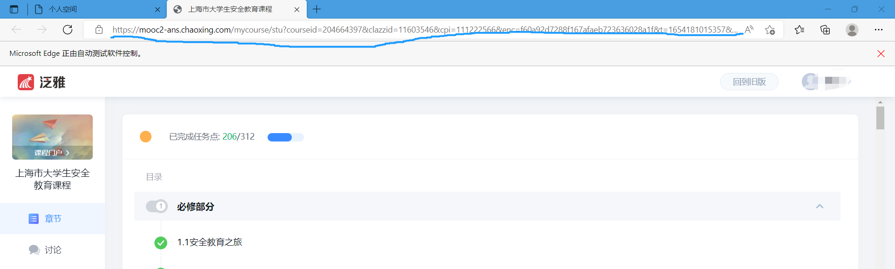
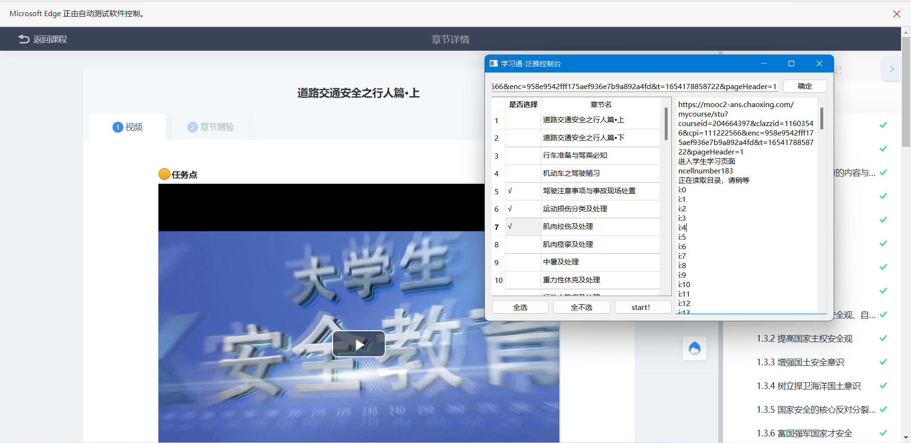

本软件仅支持带有edge浏览器的windows系统使用 
本软件仅支持学习通泛雅平台  
成品软件下载地址：[蓝奏云地址](https://xunbu.lanzoul.com/i6RIB05tvx5e)  
github：[github release](https://github.com/xunbu/xuexitong_fanya/releases)  
  
点击main.exe开始运行(webdriver的黑框框不要删除)  
在新的edge窗口里进入学习通
将课程网址(必须是带前缀的完整URL)复制到控制台地址栏中，选择要看的章节，点击start即可  

尽量不要把窗口最小化，存在失败的概率  
该程序不支持多开，若要再次使用程序，请确保已经关闭先前程序打开的浏览器窗口（注：自带的edge窗口不受影响）。  
若程序不能正常运行 请至[edgedriver网址](https://msedgewebdriverstorage.z22.web.core.windows.net)下载于edge浏览器对应版本的msedgedriver放至文件夹中  
生成的userdata文件夹存放浏览器缓存信息，可删除
